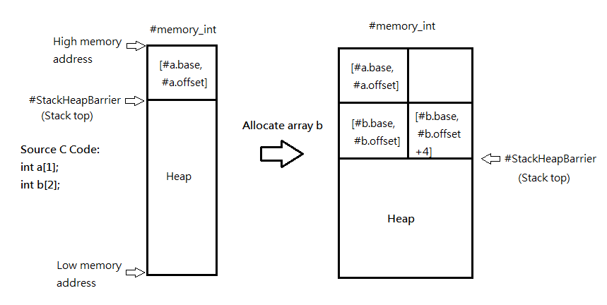

# A Supporting Library for Explicit Model Checkers of SVVRL

This project aims to create a library facilitating the implementation of explicit model
checkers for multithreaded programs. Our implementation is integrated into a Java project, called `Library-ModelCheckerAssistant`. It provides
+ on-the-fly generation of system states
+ enabledness check for transitions
+ concrete execution of a selected transition
+ ordering of processes for partial order reduction

In the following, Some tutorials and notes are presented.

## Ultimate Installation Notes 

Just follow https://github.com/ultimate-pa/ultimate/wiki/Installation

Maybe the `Project -> Build Automatically` and `Start a build immediately` (in `Clean all projects`) should be turn off. Click `Project -> Build All`, right click those projects containing errors and select `Build Project`. Try to `Refresh` both projects and packages (in `Window -> Show View -> Package Explorer`) until the errors are resolved. Errors in projects whose name contains `*web*` can be ignored.

When the installation is done, make sure that `Run -> Run Configuration -> Plug-ins -> tw.ntu.svvrl.*` are all toggled on, or `No toolchain found` will be reported.

## Settings File

Locate in `ultimate/trunk/examples/settings/SvvrlDebug.epf `. The settings can also be accessed via the GUI. (`Settings -> Ultimate Preference`).

There are two preferences I add:
1. `Use simple pthread translation`: With this preference, the translation from pthreads to Boogie is simplified using a single counting variable `#pthreadsForks` as the thread ID.

2. `Add simple implementation to memory procedure`: This preference is designed to handle the problem that the manipulations of arrays has no implementation but only post conditions. Due to the time limit, I have no time to trace the Boogie compiler and this preference does nothing currently.

The settings are modifiable if needed.

## Toolchain File

Locate in `ultimate/trunk/examples/toolchains/SvvrlDebug.xml `.

The last plugin in this file is for the debugging purpose. In `DebugPlugin -> src -> tw.ntu.svvrl.ultimate.debugplugin -> DebugObserver.java`, some test codes can be written and run with `SvvrlDebug` toolchain.

Once a model checker is completed, you should create a new plugin as well as a toolchain file. This guide (https://github.com/ultimate-pa/ultimate/wiki/Creating-a-new-plugin) may be useful for creating a new plugin.

Two model checkers with different algorithms can be deployed by
1. two different plugins
2. one plugin and create a preference for switching the algorithms, by which users can specify the algorithm they want manually in the settings file.

## Existing and Protential Problems

### 1. Pointers will not work and the handling of arrays is stupid
Ultimate has its own memory model for simulating the manipulations of arrays and pointers. For each integer array, Ultimate translates it into a contiguous memory allocation in the type of map with a base pointer address and an offset. However, the array access and store are specified by the specification and
`have no implementation`.

For example, reading an array element in Boogie is specified by the `read~int` procedure:

```
procedure read~int(#ptr.base : int, #ptr.offset : int, #sizeOfReadType : int) returns (#value : int);
ensures #value == #memory_int[#ptr.base,#ptr.offset];
modifies ;
```

But for an explicit model checker, what we expect are concrete executions, something like
```
procedure read~int(#ptr.base : int, #ptr.offset : int, #sizeOfReadType : int) returns (#value : int);
implementation read~int() returns (#value : int){
    #value := #memory_int[#ptr.base,#ptr.offset];
}
modifies ;
```

To generate the Boogie code above, we have to firstly comprehend the memory model in Ultimate and then try to modify the C to Boogie compiler. The current handling is that simply assign one side of ensures formula to the other according to the semantic. In this example, assign the value of #memory_int[#ptr.base,#ptr.offset] to #value.

The syntax of Boogie can be found in https://www.microsoft.com/en-us/research/wp-content/uploads/2016/12/krml178.pdf.

The memory model is illustrated as follows (my imagination, maybe incorrect):



### 2. Incorrect Havoc Execution

A correct model checking for havoc statements should check all possibilities. For example, 
```
var a : int;
havoc a;
```
all possible values of a (from -2147483648 to 2147483647) should be exhaustively explored during the verification. However, there are too many havoc statements in the resulting Boogie. For efficiency considerations, the execution of havoc statements is implemented by randomly assigning a value, although this way is incorrect.

To solve this problem, again, modify the compiler(translator from C to Boogie) and remove useless (for explicit-state model checkers) havocs.

One situation that havoc statements are needed is the call of `__VERIFIER_nondet_X()`, which is a convention defined by SVcomp. See https://sv-comp.sosy-lab.org/2021/rules.php for more details.


### 3. The Correctness of Nested Depth-First Search Algorithm with Partial Order Reduction Techiniques

In `TestVerifier.java`, I have implemented a model checker that follows the pseudo code in https://link.springer.com/chapter/10.1007/978-0-387-34878-0_13?fbclid=IwAR08ivdXplRAOpVRvdGTxI0GmhGNCs0MUIgEYn11L3ZMWCtE92pyA-zFxEg (a little bit different, see comments in the source file). However, lines involving partial order reduction causes the incorrect verification results. I'm not sure the problem is in our implmentation or the pseudo code. So those lines are currently commented.

### 4. The Atomicity of Statements

For modeling an atomic execution of a sequence of statements in a multithreaded program, those statements can be placed between `__VERIFIER_atomic_begin()` and `__VERIFIER_atomic_end()`. (See SVcomp's rules page for more details https://sv-comp.sosy-lab.org/2021/rules.php)

So the Peterson's algorithm looks like
``` C
extern void abort(void);
#include <assert.h>
void reach_error() { assert(0); }
extern void __VERIFIER_atomic_begin(void);
extern void __VERIFIER_atomic_end(void);

/* Testcase from Threader's distribution. For details see:
   http://www.model.in.tum.de/~popeea/research/threader
*/

#include <pthread.h>
typedef unsigned long int pthread_t;
#define assert(e) if (!(e)) ERROR: reach_error()


int flag1 = 0, flag2 = 0; // boolean flags
int turn; // integer variable to hold the ID of the thread whose turn is it
int x; // boolean variable to test mutual exclusion

void *thr1(void *_) {
    __VERIFIER_atomic_begin();
    flag1 = 1;
    __VERIFIER_atomic_end();
    __VERIFIER_atomic_begin();
    turn = 1;
    __VERIFIER_atomic_end();
    __VERIFIER_atomic_begin();
    int f21 = flag2;
    __VERIFIER_atomic_end();
    __VERIFIER_atomic_begin();
    int t1 = turn;
    __VERIFIER_atomic_end();
    while (f21==1 && t1==1) {
        __VERIFIER_atomic_begin();
        f21 = flag2;
        __VERIFIER_atomic_end();
        __VERIFIER_atomic_begin();
        t1 = turn;
        __VERIFIER_atomic_end();
    };
    // begin: critical section
    x = 0;
    assert(x<=0);
    // end: critical section
    __VERIFIER_atomic_begin();
    flag1 = 0;
    __VERIFIER_atomic_end();
    return 0;
}

void *thr2(void *_) {
    __VERIFIER_atomic_begin();
    flag2 = 1;
    __VERIFIER_atomic_end();
    __VERIFIER_atomic_begin();
    turn = 0;
    __VERIFIER_atomic_end();
    __VERIFIER_atomic_begin();
    int f12 = flag1;
    __VERIFIER_atomic_end();
    __VERIFIER_atomic_begin();
    int t2 = turn;
    __VERIFIER_atomic_end();
    while (f12==1 && t2==0) {
        __VERIFIER_atomic_begin();
        f12 = flag1;
        __VERIFIER_atomic_end();
        __VERIFIER_atomic_begin();
        t2 = turn;
        __VERIFIER_atomic_end();
    };
    // begin: critical section
    x = 1;
    assert(x>=1);
    // end: critical section
    __VERIFIER_atomic_begin();
    flag2 = 0;
    __VERIFIER_atomic_end();
    return 0;
}
  
int main() {
  pthread_t t1, t2;
  pthread_create(&t1, 0, thr1, 0);
  pthread_create(&t2, 0, thr2, 0);
  pthread_join(t1, 0);
  pthread_join(t2, 0);
  return 0;
}
```

Without `__VERIFIER_atomic_begin()` and `__VERIFIER_atomic_end()`, an assignment could be split into a read and a write, which destroy the atomicity of an assignment statement. Try to find out by comparing the Boogie programs and consider the threads' behavior.

BTW, I'm not sure a join with return values will work or not.